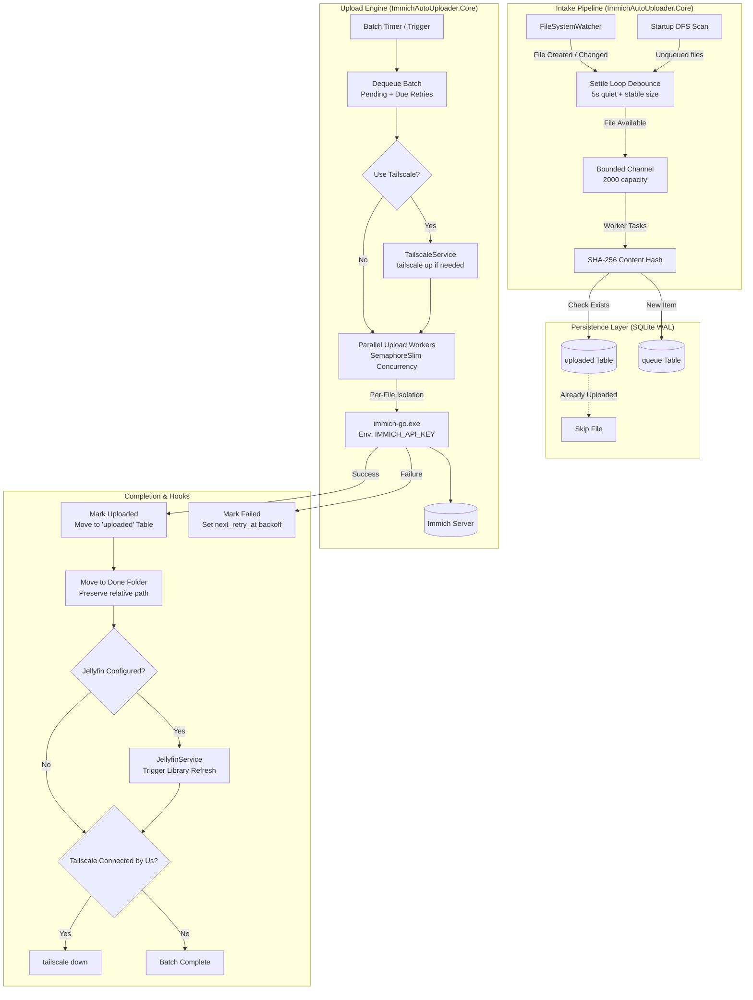
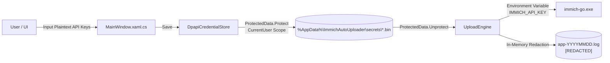

# Architecture & Technical Design

This document details the architectural design, internal workflows, data models, concurrency guarantees, and resilience strategies of **Immich Auto Uploader**.

---

## Table of Contents
1. [System Overview](#system-overview)
2. [Component Separation](#component-separation)
3. [Lifecycle & Ingestion Workflow](#lifecycle--ingestion-workflow)
4. [Persistent Queue & Database Schema](#persistent-queue--database-schema)
5. [Upload Engine & Process Isolation](#upload-engine--process-isolation)
6. [Ecosystem Integration Hooks](#ecosystem-integration-hooks)
7. [Security & Credential Architecture](#security--credential-architecture)
8. [Concurrency & Threading Model](#concurrency--threading-model)
9. [Failure Modes & Recovery Strategies](#failure-modes--recovery-strategies)

---

## System Overview

Immich Auto Uploader is a continuous ingestion daemon and system tray application designed for Windows. It provides zero-touch synchronization between local storage (e.g., camera ingest folders, SD card dump points, or staging directories) and a self-hosted [Immich](https://immich.app/) instance.

Rather than relying on periodic folder scans or single monolithic CLI runs, the application couples real-time file-system event monitoring with persistent queueing and per-file process isolation.



---

## Component Separation

The repository is structured into two clean layers:

### 1. `ImmichAutoUploader.Core` (Class Library, `net10.0`)
A headless, dependency-injected core containing all business logic, file watching, database interactions, process spawning, and external service communication. It has no dependencies on UI frameworks or Windows Forms, making it fully unit-testable and portable.

Key namespaces:
- `ImmichAutoUploader.Core.Models`: Strongly typed models representing application settings ([AppSettings.cs](file:///c:/Users/Joe%20Urbanek/Documents/Antigravity/immich-auto-uploader/src/ImmichAutoUploader.Core/Models/AppSettings.cs)), queue items ([QueuedFile.cs](file:///c:/Users/Joe%20Urbanek/Documents/Antigravity/immich-auto-uploader/src/ImmichAutoUploader.Core/Models/QueuedFile.cs)), and batch credentials ([EngineCredentials.cs](file:///c:/Users/Joe%20Urbanek/Documents/Antigravity/immich-auto-uploader/src/ImmichAutoUploader.Core/Models/EngineCredentials.cs)).
- `ImmichAutoUploader.Core.Security`: Windows DPAPI-backed secure storage ([DpapiCredentialStore.cs](file:///c:/Users/Joe%20Urbanek/Documents/Antigravity/immich-auto-uploader/src/ImmichAutoUploader.Core/Security/DpapiCredentialStore.cs)) conforming to [ICredentialStore.cs](file:///c:/Users/Joe%20Urbanek/Documents/Antigravity/immich-auto-uploader/src/ImmichAutoUploader.Core/Security/ICredentialStore.cs).
- `ImmichAutoUploader.Core.Services`: Core operational services:
  - [FileWatcherService.cs](file:///c:/Users/Joe%20Urbanek/Documents/Antigravity/immich-auto-uploader/src/ImmichAutoUploader.Core/Services/FileWatcherService.cs): Settle loop and directory intake.
  - [UploadQueue.cs](file:///c:/Users/Joe%20Urbanek/Documents/Antigravity/immich-auto-uploader/src/ImmichAutoUploader.Core/Services/UploadQueue.cs): SQLite persistence and deduplication engine.
  - [UploadEngine.cs](file:///c:/Users/Joe%20Urbanek/Documents/Antigravity/immich-auto-uploader/src/ImmichAutoUploader.Core/Services/UploadEngine.cs): Batch coordinator and worker manager.
  - [ImmichGoRunner.cs](file:///c:/Users/Joe%20Urbanek/Documents/Antigravity/immich-auto-uploader/src/ImmichAutoUploader.Core/Services/ImmichGoRunner.cs): Process wrapper for `immich-go`.
  - [TailscaleService.cs](file:///c:/Users/Joe%20Urbanek/Documents/Antigravity/immich-auto-uploader/src/ImmichAutoUploader.Core/Services/TailscaleService.cs): On-demand VPN lifecycle manager.
  - [JellyfinService.cs](file:///c:/Users/Joe%20Urbanek/Documents/Antigravity/immich-auto-uploader/src/ImmichAutoUploader.Core/Services/JellyfinService.cs): Post-upload media library sync.
  - [ProcessHelper.cs](file:///c:/Users/Joe%20Urbanek/Documents/Antigravity/immich-auto-uploader/src/ImmichAutoUploader.Core/Services/ProcessHelper.cs): Async process runner with argument isolation and process-tree termination.
  - [AppLogger.cs](file:///c:/Users/Joe%20Urbanek/Documents/Antigravity/immich-auto-uploader/src/ImmichAutoUploader.Core/Services/AppLogger.cs): Thread-safe file logger with retention management.

### 2. `ImmichAutoUploader.App` (Desktop Shell, `net10.0-windows`)
A lightweight Windows Presentation Foundation (WPF) and Windows Forms interop shell providing desktop integration:
- [App.xaml.cs](file:///c:/Users/Joe%20Urbanek/Documents/Antigravity/immich-auto-uploader/src/ImmichAutoUploader.App/App.xaml.cs): Application entry point, single-instance named mutex acquisition (`Local\ImmichAutoUploader_SingleInstance`), service bootstrap, and graceful shutdown orchestration.
- [MainWindow.xaml.cs](file:///c:/Users/Joe%20Urbanek/Documents/Antigravity/immich-auto-uploader/src/ImmichAutoUploader.App/MainWindow.xaml.cs): Configuration window, real-time queue status counters, folder selectors, connection test execution, and Windows startup registry integration.
- [TrayIconManager.cs](file:///c:/Users/Joe%20Urbanek/Documents/Antigravity/immich-auto-uploader/src/ImmichAutoUploader.App/TrayIconManager.cs): System tray icon lifecycle, context menu, and balloon tip notifications.

---

## Lifecycle & Ingestion Workflow

### 1. Detection and Settle Debounce
File copying on Windows (especially large raw images and multi-gigabyte video recordings) produces rapid `Created` and `Changed` events long before the file is fully written:
1. When an event fires, [FileWatcherService](file:///c:/Users/Joe%20Urbanek/Documents/Antigravity/immich-auto-uploader/src/ImmichAutoUploader.Core/Services/FileWatcherService.cs) validates that the path is not a temporary file, not located in the Done folder, and matches known media extensions (`.jpg`, `.heic`, `.cr3`, `.mp4`, `.mov`, etc.).
2. The file is placed into a concurrent tracking map (`_pending`) with its current timestamp and size.
3. A background timer loop checks `_pending` every 2 seconds:
   - **Time Settle**: The file must have received no new events for at least 5 seconds (`_settleDelay`).
   - **Size Settle**: The current file length must match the length observed during the previous tick.
   - **Read Availability**: A transient `FileStream` is opened with `FileShare.ReadWrite`. If the write handle is exclusively locked by another process (e.g. camera transfer software), intake waits.
4. Once settled, the file path is emitted into a bounded `Channel<string>` with capacity 2000. While queued in the channel, the file remains in `_pending` with a sentinel timestamp (`DateTime.MaxValue`) to prevent duplicate queueing.

### 2. Content Hashing & Deduplication
Four parallel worker tasks consume from the bounded channel:
1. Each worker invokes [UploadQueue.TryEnqueueAsync](file:///c:/Users/Joe%20Urbanek/Documents/Antigravity/immich-auto-uploader/src/ImmichAutoUploader.Core/Services/UploadQueue.cs#L105).
2. The worker streams the file through `SHA256.Create()` using an 80 KB async buffer.
3. **Hashing occurs completely outside the SQLite lock** so ongoing database reads and writes are never blocked by heavy disk I/O.
4. The database is checked:
   - If the hash exists in the `uploaded` table, the file is skipped ([EnqueueResult.AlreadyUploaded](file:///c:/Users/Joe%20Urbanek/Documents/Antigravity/immich-auto-uploader/src/ImmichAutoUploader.Core/Models/QueuedFile.cs#L24)).
   - If the hash is already in the `queue` table with the same path, it is skipped ([EnqueueResult.AlreadyQueued](file:///c:/Users/Joe%20Urbanek/Documents/Antigravity/immich-auto-uploader/src/ImmichAutoUploader.Core/Models/QueuedFile.cs#L25)).
   - If the hash exists in `queue` under an old path that no longer exists (e.g., the user renamed or moved the file before upload), the queue record is updated to the new path.
   - Otherwise, the file is inserted into `queue` with status `'Pending'`.

---

## Persistent Queue & Database Schema

The queue is stored in an embedded SQLite database at `%AppData%\ImmichAutoUploader\upload-queue.db`.

### Database Pragmas
Upon opening the connection, the database executes:
```sql
PRAGMA journal_mode = WAL;
PRAGMA synchronous = NORMAL;
```
- **WAL (Write-Ahead Logging)** allows concurrent readers and non-blocking checkpointing.
- **`synchronous = NORMAL`** ensures durability across application crashes without the heavy performance penalty of full disk syncs on every single write.

### Schema Definition
```sql
CREATE TABLE IF NOT EXISTS queue (
    id            INTEGER PRIMARY KEY AUTOINCREMENT,
    source_path   TEXT NOT NULL,
    file_hash     TEXT NOT NULL,
    file_size     INTEGER NOT NULL DEFAULT 0,
    status        TEXT NOT NULL DEFAULT 'Pending',
    attempts      INTEGER NOT NULL DEFAULT 0,
    last_error    TEXT,
    next_retry_at TEXT,
    detected_at   TEXT NOT NULL,
    updated_at    TEXT NOT NULL
);

CREATE INDEX IF NOT EXISTS idx_queue_status ON queue(status);
CREATE UNIQUE INDEX IF NOT EXISTS idx_queue_hash_unique ON queue(file_hash);
CREATE INDEX IF NOT EXISTS idx_queue_status_retry_detected ON queue(status, next_retry_at, detected_at);

CREATE TABLE IF NOT EXISTS uploaded (
    file_hash       TEXT PRIMARY KEY,
    source_path     TEXT NOT NULL,
    uploaded_at     TEXT NOT NULL,
    immich_asset_id TEXT
);
```

### Table Lifecycles
- `queue`: Holds active work items. Items transition through states:
  - `'Pending'`: Awaiting batch dequeue.
  - `'Uploading'`: Dequeued by an active upload batch.
  - `'Failed'`: Encountered an upload error. Holds `last_error` and `next_retry_at`.
- `uploaded`: Permanent audit table recording every completed hash. Even if the original file is re-added months later, the uploader verifies against `uploaded` and skips it.

---

## Upload Engine & Process Isolation

The [UploadEngine](file:///c:/Users/Joe%20Urbanek/Documents/Antigravity/immich-auto-uploader/src/ImmichAutoUploader.Core/Services/UploadEngine.cs) coordinates batch execution on a timer ([AppSettings.BatchIntervalMinutes](file:///c:/Users/Joe%20Urbanek/Documents/Antigravity/immich-auto-uploader/src/ImmichAutoUploader.Core/Models/AppSettings.cs#L60)) or on demand via `TriggerNowAsync`:

### 1. Batch Dequeue
```sql
SELECT id, source_path, file_hash, file_size, status, attempts, last_error, detected_at
FROM queue
WHERE (status = 'Pending' OR (status = 'Failed' AND next_retry_at <= $now))
  AND (next_retry_at IS NULL OR next_retry_at <= $now)
ORDER BY detected_at ASC LIMIT $n;
```
Dequeued items are immediately transitioned to `'Uploading'`.

### 2. Per-File Process Isolation
Rather than passing an entire directory to `immich-go`, the engine executes **one process per file**:
- Exit code `0` deterministically indicates that the specific file is safely in Immich.
- Any non-zero exit code affects only that single file. A corrupt EXIF tag, truncated JPEG, or unsupported video codec can never fail or abort other files in the batch.
- Subprocesses run with `--on-errors stop` so errors immediately surface via exit code.

### 3. Parallelism Throttling
Uploads run concurrently up to [AppSettings.ConcurrentTasks](file:///c:/Users/Joe%20Urbanek/Documents/Antigravity/immich-auto-uploader/src/ImmichAutoUploader.Core/Models/AppSettings.cs#L57) (clamped between 1 and 20), throttled via an asynchronous `SemaphoreSlim`.

### 4. Move-to-Done Semantics
Upon exit code `0`, the source file is moved to the configured `DoneFolder`:
- **Hierarchy Preservation**: The relative directory structure between `WatchFolder` and the file is preserved in `DoneFolder` (e.g. `watch\2026\09\photo.jpg` moves to `done\2026\09\photo.jpg`).
- **Collision Avoidance**: If `done\2026\09\photo.jpg` already exists, it is renamed with a numeric suffix (`photo (2).jpg`).
- **Cross-Volume Resilience**: If `WatchFolder` and `DoneFolder` reside on different drive volumes or network shares, `File.Move` fails. The engine falls back to an atomic copy-and-delete pattern with exponential backoff (up to 5 attempts). If deletion of the source fails after all retries, the copied target is removed to prevent orphan duplicates.
- **Fail-Safe Guarantee**: If the move operation completely fails, the file remains in place. Because it was already recorded in `uploaded`, subsequent scans will identify the hash and safely skip it.

---

## Ecosystem Integration Hooks

### Tailscale Integration (`TailscaleService`)
Allows remote ingestion when outside the home local area network:
1. **Queue Check**: Tailscale is only brought up if `CountDue() > 0`. If the queue is empty, network state is untouched.
2. **Path Discovery**: Searches explicit `TailscalePath`, standard `%ProgramFiles%\Tailscale\tailscale.exe`, and system `PATH` via `where.exe`.
3. **State Inspection**: Queries `tailscale status --json`. If already `Running`, the engine marks `ConnectedByUs = false`.
4. **On-Demand Connection**: If disconnected, runs `tailscale up --timeout=10s` and records `ConnectedByUs = true`. If the machine requires authentication, the login URL is extracted via regex and surfaced to the user.
5. **Alternate Endpoint**: When connected, uses [AppSettings.ImmichUrlViaTailscale](file:///c:/Users/Joe%20Urbanek/Documents/Antigravity/immich-auto-uploader/src/ImmichAutoUploader.Core/Models/AppSettings.cs#L47) (e.g. Tailscale MagicDNS or 100.x IP) instead of the primary URL.
6. **Teardown Contract**: In the `finally` block of the batch, the engine calls `tailscale down` **only if `ConnectedByUs == true`**. User-initiated VPN connections are preserved.

### Jellyfin Integration (`JellyfinService`)
Triggers an automated media library scan immediately after an upload batch completes:
1. Fires only if at least one file was successfully uploaded.
2. Uses the required `Authorization: MediaBrowser Token="..."` header format.
3. If [AppSettings.JellyfinLibraryName](file:///c:/Users/Joe%20Urbanek/Documents/Antigravity/immich-auto-uploader/src/ImmichAutoUploader.Core/Models/AppSettings.cs#L33) is set, resolves the library ID via `GET /Library/MediaFolders` and requests `POST /Items/{id}/Refresh?Recursive=true`. If left blank, it triggers `POST /Library/Refresh`.
4. Jellyfin API failures are logged as warnings and never fail or block the upload batch.

---

## Security & Credential Architecture



### 1. Windows DPAPI Encryption
- API keys (Immich API Key, Immich Admin API Key, Jellyfin API Key) are encrypted using `ProtectedData.Protect` with `DataProtectionScope.CurrentUser`.
- Ciphertext is written to `%AppData%\ImmichAutoUploader\secrets\<name>.bin` via an atomic `.tmp` swap.
- Only the exact Windows user account on the same physical machine can decrypt these blobs. Plaintext secrets are never stored in `settings.json`.

### 2. Process Argument Sanitization
- Many CLI tools expose API keys in command-line arguments, leaving them visible in Task Manager, Process Explorer, and Windows Event ID 4688 logs.
- Immich Auto Uploader passes `IMMICH_API_KEY` and `IMMICH_ADMIN_API_KEY` exclusively through **process environment variables** via [ProcessHelper.RunAsync](file:///c:/Users/Joe%20Urbanek/Documents/Antigravity/immich-auto-uploader/src/ImmichAutoUploader.Core/Services/ProcessHelper.cs#L22).
- Non-secret CLI arguments are passed via `ProcessStartInfo.ArgumentList` to bypass shell interpretation and injection.

### 3. Log Redaction
- When `immich-go` or HTTP hooks return errors, output is passed through [UploadEngine.RedactSecrets](file:///c:/Users/Joe%20Urbanek/Documents/Antigravity/immich-auto-uploader/src/ImmichAutoUploader.Core/Services/UploadEngine.cs#L355), replacing any matching API keys with `[REDACTED]` prior to logging.

---

## Concurrency & Threading Model

| Component | Threading Model | Synchronization Mechanism |
| :--- | :--- | :--- |
| **`UploadQueue`** | Thread-safe across all methods | Internal `_lock` object serializing all SQLite commands; hashing runs unlocked. |
| **`FileWatcherService`** | Multi-producer, multi-consumer | `FileSystemWatcher` events push to `ConcurrentDictionary`; settle loop pushes to bounded `Channel<string>`; 4 consumer tasks dequeue and hash. |
| **`UploadEngine`** | Single batch at a time | `SemaphoreSlim(1, 1)` prevents overlapping timer or manual batches; `_batchTaskLock` coordinates active task tracking. |
| **Upload Workers** | Parallel worker pool | `SemaphoreSlim(parallelism, parallelism)` throttles `immich-go` processes to `ConcurrentTasks`. |
| **`AppLogger`** | Thread-safe file writer | Private `_lock` serializes disk appends; never throws. |
| **WPF UI** | Single UI thread | `Dispatcher.Invoke` marshals queue status and notifications from background services. |

---

## Failure Modes & Recovery Strategies

### 1. Application Crash During Upload
- **Problem**: The app or system crashes while files are in `'Uploading'` state.
- **Recovery**: On startup, [UploadQueue.ResetStuckUploading](file:///c:/Users/Joe%20Urbanek/Documents/Antigravity/immich-auto-uploader/src/ImmichAutoUploader.Core/Services/UploadQueue.cs#L396) resets all `'Uploading'` records back to `'Pending'` and clears `next_retry_at`.

### 2. Transient File System Locks
- **Problem**: Antivirus software or sync clients lock a newly created photo during ingest.
- **Recovery**:
  - Settle loop tests file availability with `FileShare.ReadWrite`.
  - Hashing or enqueueing errors catch `IOException` and reset the settle timestamp for automatic retry.

### 3. Exponential Backoff on Upload Failure
- **Problem**: The Immich server is temporarily unreachable or returning HTTP 500.
- **Recovery**:
  - Failed items have their `attempts` counter incremented.
  - Delay is calculated as:
    $$\text{delayMinutes} = \min(5 \times 2^{\text{attempts} - 1}, 240)$$
  - Progression: 5 min $\to$ 10 min $\to$ 20 min $\to$ 40 min $\to$ 80 min $\to$ 160 min $\to$ 240 min (cap).
  - Users can bypass backoff at any time using the **"Retry Failed"** UI button or tray menu.

### 4. File Watcher Buffer Overflow
- **Problem**: A bulk copy of 50,000 files overflows the 64 KB `FileSystemWatcher` buffer.
- **Recovery**: The `_watcher.Error` handler catches the overflow event, logs a warning, and launches an asynchronous depth-first traversal of the watch directory (`InitialScanAsync`).
