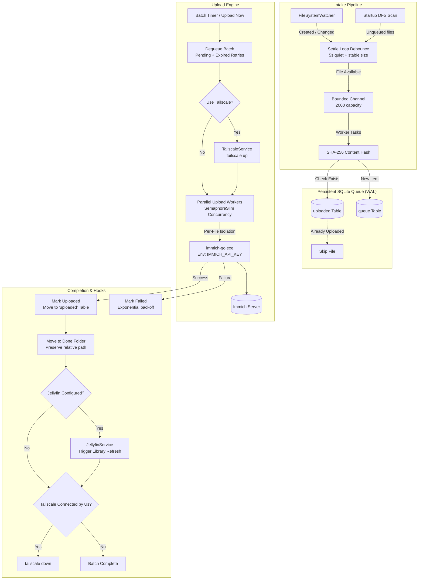

# Immich Auto Uploader

[](https://github.com/jurbanek756/immich-auto-uploader/actions)
[](https://github.com/jurbanek756/immich-auto-uploader/releases)
[](https://dotnet.microsoft.com/download/dotnet/10.0)
[](https://www.microsoft.com/windows)
[](LICENSE)

A resilient Windows system tray application (.NET 10 / WPF) that continuously watches a folder and automatically ingests photos and videos into a self-hosted [Immich](https://immich.app/) instance using a bundled, version-pinned `immich-go` binary.

Designed for set-and-forget background ingestion from camera import directories, SD card dump points, and staging folders.

---

## The "Why" (Value Proposition)

Running manual CLI scripts, periodic cron jobs, or basic file watchers against an Immich instance often leads to silent failures, duplicate uploads, or half-copied files. **Immich Auto Uploader** was engineered to eliminate these exact operational pain points:

- **Per-File Process Isolation**: Monolithic uploads over an entire directory often crash or abort when hitting a single corrupt EXIF header, unsupported codec, or truncated file. Immich Auto Uploader runs a dedicated `immich-go` process per file. If one file fails, it has zero impact on the rest of the batch.
- **Reliable Intake (5-Second Settle Debounce)**: Transferring multi-gigabyte video files or raw camera bursts takes time. The uploader monitors file size stability across multiple timer ticks and validates read locks, ensuring files are only ingested once writing has completely finished. Zero-byte files are flagged and skipped cleanly without terminating runs.
- **Guaranteed Persistence & Deduplication**: A local SQLite database running in WAL mode tracks all pending and completed files by their **SHA-256 content hash**. Renaming files, moving them across subdirectories, or restarting the computer will never cause a duplicate upload. Interrupted uploads automatically recover on startup.
- **Move-to-Done Semantics**: Once verified as uploaded by Immich, files are moved (never deleted) into a designated `Done` directory, preserving their relative subfolder structure (e.g. `watch\2026\09\photo.jpg` $\to$ `done\2026\09\photo.jpg`).
- **Ecosystem Integration Hooks**:
  - *Tailscale On-Demand*: Connects to your Tailscale network (`tailscale up`) before uploading when you're away from home and disconnects afterwards, leaving existing manual VPN sessions untouched.
  - *Jellyfin Sync*: Automatically triggers a Jellyfin media library refresh after successful uploads so new media is immediately browsable.

---

## Architecture Lifecycle



For full technical specifications, database schema diagrams, and threading guarantees, see [ARCHITECTURE.md](ARCHITECTURE.md).

---

## Quick Start & Installation

### Option 1: Download Pre-Built Release
1. Go to the [Releases](https://github.com/jurbanek756/immich-auto-uploader/releases) page.
2. Download the latest `ImmichAutoUploader-vX.Y.Z-win-x64.zip`.
3. Extract the archive to any folder (e.g. `C:\Program Files\ImmichAutoUploader` or `%LocalAppData%\Programs\ImmichAutoUploader`).
4. Launch `ImmichAutoUploader.exe`. The application opens its settings window on first run.

### Option 2: Building from Source

#### Prerequisites
- Windows 10 or 11
- [.NET 10 SDK](https://dotnet.microsoft.com/download/dotnet/10.0) or later
- PowerShell 7+ or Windows PowerShell 5.1

```powershell
# 1. Clone the repository
git clone https://github.com/jurbanek756/immich-auto-uploader.git
cd immich-auto-uploader

# 2. Download and pin the latest immich-go binary into tools/immich-go/
.\build.ps1

# 3. Build the solution
dotnet build ImmichAutoUploader.sln -c Release

# 4. Publish a single-file executable
dotnet publish src\ImmichAutoUploader.App\ImmichAutoUploader.App.csproj `
  -c Release `
  -r win-x64 `
  --self-contained true `
  -o publish
```

---

## Configuration Reference

Non-secret settings are stored as JSON in `%AppData%\ImmichAutoUploader\settings.json`.

| Setting | Type | Default | Description |
| :--- | :--- | :--- | :--- |
| `immichUrl` | string | `""` | Base URL of your Immich server (e.g. `https://immich.example.com`). |
| `watchFolder` | string | `""` | Directory to monitor for new photos and videos. |
| `doneFolder` | string | `""` | Destination folder where uploaded files are moved. Subfolder structures are preserved. |
| `jellyfinUrl` | string | `""` | Optional. Base URL of your Jellyfin server. |
| `jellyfinLibraryName` | string | `""` | Optional. Name of the Jellyfin library to refresh. If blank, triggers a full library scan. |
| `useTailscale` | boolean | `false` | When enabled, connects Tailscale before an upload batch and disconnects it afterwards. |
| `immichUrlViaTailscale` | string | `""` | Optional. Immich server URL to use when connected to Tailscale (e.g. `http://100.x.y.z:2283`). |
| `tailscalePath` | string | `""` | Optional. Custom path to `tailscale.exe`. Auto-detected if blank. |
| `immichGoPath` | string | `""` | Path to `immich-go.exe`. Defaults to the bundled binary in `tools\immich-go\`. |
| `immichGoVersion` | string | `""` | Pinned version string recorded by `build.ps1`. |
| `concurrentTasks` | integer | `4` | Number of simultaneous `immich-go` upload processes (1–20). |
| `onErrors` | string | `"continue"` | Batch behavior on failure: `"continue"` (skip failed file and proceed) or `"stop"` (pause batch). |
| `pauseImmichJobs` | boolean | `true` | Tells Immich to pause server background jobs during upload. Requires an admin API key. |
| `batchIntervalMinutes`| integer | `5` | Minutes between automatic upload batch runs. |
| `maxFilesPerBatch` | integer | `100` | Maximum number of files processed in a single batch. |
| `deviceUuid` | string | *(auto)* | Stable UUID generated per machine and sent as `--device-uuid` to distinguish upload sources. |
| `startWithWindows` | boolean | `true` | Registers the app under `HKCU\Software\Microsoft\Windows\CurrentVersion\Run`. |

---

## Security Model

Immich Auto Uploader treats credentials with enterprise-grade hygiene:

1. **Windows DPAPI Encryption (`CurrentUser` Scope)**:
   - All API keys (Immich API Key, Immich Admin API Key, Jellyfin API Key) are encrypted using Windows Data Protection API (`ProtectedData.Protect`).
   - Encrypted blobs are saved under `%AppData%\ImmichAutoUploader\secrets\<name>.bin`.
   - Keys can only be decrypted by the same Windows user account on the same physical computer.
   - **Secrets never appear in `settings.json`, log files, or UI error messages.**
2. **Process Argument Isolation**:
   - Secrets are **never passed as command-line arguments** to `immich-go`. They are passed exclusively via process environment variables (`IMMICH_API_KEY`, `IMMICH_ADMIN_API_KEY`).
   - This prevents API keys from being captured by Windows Event ID 4688 logging, Task Manager, Process Hacker, or command-line auditing tools.
3. **Log Redaction**:
   - Any error output returned by external processes or HTTP services is filtered through in-memory redaction before being written to disk (`AppLogger`).

---

## Troubleshooting & FAQ

<details>
<summary><strong>Tailscale prompts for authentication or fails to connect</strong></summary>

If Tailscale requires interactive authentication, the application will display a Windows notification and surface the login URL. To resolve:
1. Open the login URL shown in the alert or in the application logs (`%AppData%\ImmichAutoUploader\logs\app-YYYYMMDD.log`).
2. Complete authentication in your browser.
3. Once the node is authenticated, the uploader will automatically establish connections on subsequent batches.
</details>

<details>
<summary><strong>Jellyfin connection test returns HTTP 401 Unauthorized</strong></summary>

This application targets modern Jellyfin instances requiring the `Authorization: MediaBrowser Token="..."` header format.
- Ensure your Jellyfin API key was generated from an administrator account under **Dashboard > Advanced > API Keys**.
- Do not pass username/password credentials; enter only the raw API token.
</details>

<details>
<summary><strong>Antivirus or file lock errors during file moves</strong></summary>

Windows indexing services, backup software, or antivirus scanners may hold locks on newly created media files:
- The upload engine includes an exponential retry loop (up to 5 attempts) to handle transient sharing violations.
- If a move cannot complete, the file remains in the watch directory. Because its SHA-256 hash is already committed to the `uploaded` table, it will **never be uploaded twice**.
</details>

<details>
<summary><strong>Why are 0-byte files skipped?</strong></summary>

Immich rejects zero-byte files as invalid media assets. In older scripts, zero-byte files would crash the upload run. Immich Auto Uploader detects empty files during the settle check, logs a warning, and safely skips them.
</details>

---

## Contributing & License

Contributions are welcome! Please see [CONTRIBUTING.md](CONTRIBUTING.md) for build instructions, code standards, and PR guidelines.

This project is licensed under the [MIT License](LICENSE).
